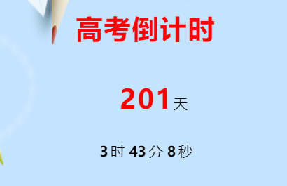

# H5案例小总结

## 案例说明

#### 使用原生JS,无任何框架,适配移动端PC端兼容;布局功能均参考不同的可视化作品,大部分素材来自于网咯,此案例包含平常大部分所需用的逻辑,后期也会间断更新.点击预览:http://chen-1999.gitee.io/h5review

#### 码云:https://gitee.com/chen-1999/h5review

#### 个人网页:http://chen-1999.gitee.io/skip

#### 平台(扒下来的游戏汇总):http://chen-1999.gitee.io/game

## 实现功能

### 加载

#### 数字加载

#### 小数点加载

#### 动画加载

#### 进度条加载


小圆作为动画加载,从舞台外围绕舞台中心旋转进入,居中后不停闪动

进度条由灰色变为淡黄色,(淡黄色渐渐充满进度条)

小数点三点无限循环

数字由0至100,当条件满足时跳转下一页

### 自转与公转(定位与弹性盒子)


### 移动端拖拽touch事件

#### 实现计算(坐标,位移,大小,透明度...)

实现位移(即翻页效果(主要为):上下,左右,淡入淡出)


小车以底部为轴循环放大缩小,车可拖动,背景图片相反位移,呈现出透明度由0~1的字体(需计算)

### click事件监听


仅按规定循序点击即可跳转下一页,否则清空打印的内容

### 类似蒙版效果(结合拖动)


### 答题模拟效果(事件触发传参)


### 文字镂空效果


### 点亮图标小游戏


点击任意方框单次点击出现,再次点击消失;累计...全部点亮时跳转下一页

### 实时倒计时



### 点赞爱心效果


点击区域出现小爱心动画

### 计算机效果


### 音乐播放与暂停


## 实现逻辑

##### 加载

```
page_load = ()=>{
//获取与定义相关变量
    let content = document.querySelector(".content");
    let load = document.querySelector(".load span");
    let dot_span = document.querySelector(".page1_dot span");
    let dot_p = document.querySelector(".page1_dot p");
    let num = count = 0,str = '',timer1,timer2,timer3;
//进度条直接控制样式宽度    
    timer1 = setInterval(()=>{
        num++;
        load.style.width = num + '%';
        if(num == 100){
            clearInterval(timer1);
        }
    },50)
//小数点自增循环
    timer2 = setInterval(()=>{
        str = str + '.';
        dot_p.innerText = str;
        if(str.length == 3){
            str = '';
        }
    },200)
//数字定时器自增 
    timer3 = setInterval(()=>{
        count++;
        dot_span.innerText = count + '%';
        if(count >= 100){
            clearInterval(timer2);
            content.style.transform = 'translateY(-740px)';
            clearInterval(timer3);
        }
    },50)
}
```

##### 定位

自转与公转:(可理解为自身自转,定位在父元素应有的位置上让父元素也自转)

```
    <div class="page2_circle">
        
        
        
        
        
    </div>
```

##### touch事件

```
page3_car = ()=>{
//获取与定义相关变量
    let page3_content = document.querySelector(".page3_content");
    let page3_b = document.querySelector(".page3_content b");
    let page3_strong = document.querySelector(".page3_content strong");
    let page3_car = document.querySelector("#page3 img");
    let width = document.body.offsetWidth - page3_car.offsetWidth/2;
    let startX,moveX,endX;

//拖拽开始时	
    page3_car.addEventListener("touchstart",e=>{
//函数自带参数用e表示,兼容IE(e||window.event)
        let ev = e||window.event;
//当触摸开始时获取点击位置距离屏幕的距离(不算自身的距离)        
        startX = ev.targetTouches[0].clientX - page3_car.offsetLeft;
    })
//开始时计算    
    page3_car.addEventListener("touchmove",e=>{
        let ev = e||window.event;
        endX = ev.targetTouches[0].clientX;
//移动的距离(实时变化)        
        moveX = endX - startX;
//当移动距离超过body宽度时...        
        if(moveX < 0){
            moveX = 0;
        }
//当移动距离大于body宽度时...        
        if(moveX > width){
            moveX = width;
        }
//计算与翻页        
        page3_car.style.left = moveX + 'px';
        page3_b.style.opacity = 0;
        page3_strong.style.opacity = 0;
        page3_content.style.transform = `translateX(${-moveX*2}px)`;
        if(moveX >3 && moveX < 150){
            page3_b.style.opacity = 1;
        }
        if(moveX >200 && moveX < 300){
            page3_strong.style.opacity = 1;
        }
    })
}
```

##### 传参

```
//初始化    
    let str = '美丽中国',num=star='';
    let click = ()=>{
        num = '';
        star = '';
        page4_star.innerText = '';
    }
    let font = ()=>{
        if(num.length >= 4){
            return;
        }
        else{
            star = star + '*';
            page4_star.innerText = star;
        }
    }
    page4_btn[0].addEventListener("click",()=>{
        click();
    })
//当他们相等时跳转    
    page4_btn[1].addEventListener("click",()=>{
        if(num === str){
            content.style.transform = `translateY(-${740*4}px)`;
        }
        click();
    })
//点相应的就让num自增对应的字符(可用for循环与数组)    
    page4_font[0].addEventListener("click",()=>{
        font();
        num = num + '国';
    })
    page4_font[1].addEventListener("click",()=>{
        font();
        num = num + '美';
    })
    page4_font[2].addEventListener("click",()=>{
        font();
        num = num + '丽';
    })
    page4_font[3].addEventListener("click",()=>{
        font();
        num = num + '中';
    })

```

##### 蒙版效果

```
page5_shade = ()=>{
    let shade = document.querySelector(".shade");
    let page5 = document.querySelectorAll(".page");
    page5[4].addEventListener("touchmove",e=>{
        let ev = e||window.event;
        let moveX = ev.changedTouches[0].pageX;
        let moveY = ev.changedTouches[0].pageY;
        shade.style.clipPath = `circle(50px at ${moveX}px ${moveY}px)`;
    })
}
//主要是clip-Path这个剪裁属性
```

##### 事件触发传参

```
//函数触发并传参(次数,分数)
<div class="page_issue">
    <h2>“少壮不努力，老大徒_____”出自《汉乐府·长歌行》。</h2>
    <p onclick="page6_pair(1,0)">悲伤</p>
    <p onclick="page6_pair(1,1)">伤悲</p>
    <p onclick="page6_pair(1,0)">忧伤</p>
</div>

//外部定义变量
let score_str = 0;
page6_pair = (next,score)=>{
    let index = 0;
    let content = document.querySelector(".content");
    let page_issue = document.querySelectorAll(".page_issue");
    let page6_content = document.querySelector(".page6_content h3");
    let name = ['跟班','下生','书童','书生','绣花','举人','进士','探花','榜眼','状元'];
//答对加1,打错加0
    score_str += score;
//点击答案即让下一题显示,本题消失    
    index = next - 1;
	page_issue[index].style.display = 'none';

    if(next >= 10){
        page6_content.style.display = 'block';
        page6_content.innerText = `答对${score_str}道,获得<${name[score_str-1]}>称号`;
        content.style.transform = `translateY(-${740*6}px)`;
    }
    else{
        page_issue[next].style.display = 'block';
    }
}
```

##### 点亮图标

```
page7_game = ()=>{
    let content = document.querySelector(".content");
    let page7_footer = document.querySelector(".page7_footer button");
    let page7_content = document.querySelectorAll(".page7_content span");
    let str = '111111111',count = [0,0,0,0,0,0,0,0,0],timer;
//当点击重来时初始化所有值
    page7_footer.addEventListener("click",()=>{
        count = [0,0,0,0,0,0,0,0,0];
        for(let i=0;i<page7_content.length;i++){
            page7_content[i].style.background = 'rgb(255, 242, 231)';
        }
    })
//splice(修改第几位,删除个数,添加的内容[可为数组])
    for(let j=0;j<page7_content.length;j++){
        page7_content[j].addEventListener("click",()=>{
            if(j == 0){
                if(count[0]){
                    page7_content[0].style.background = 'rgb(255, 242, 231)';
                    count.splice(0,1,0);
                }
                else{
                    page7_content[0].style.background = 'sandybrown';
                    count.splice(0,1,1);
                }
            }
            else{
                if(count[j]){
                    page7_content[j].style.background = 'rgb(255, 242, 231)';
                    count.splice(j,1,0);
                }
                else{
                    page7_content[j].style.background = 'sandybrown';
                    count.splice(j,1,1);
                }
            }
//join(将数组拼接)例:count=["0","1"];count.join("-") = 0-1;            
            let num = count.join("");
            if(num === str){
                timer = setTimeout(() => {
                    content.style.transform = `translateY(-${740*7}px)`;
                }, 1000);
            }
        })
    }
}

```

##### 倒计时

```
time = ()=>{
//获取时间
        let nowTime = new Date();
//定义时间        
        let endTime = new Date("2021/7/18");
//时间差        
        let disTime = endTime.getTime() - nowTime.getTime();
        let day = Math.floor(disTime/(1000*60*60*24));
        let hour = Math.floor(disTime/(1000*60*60)%24);
        let minute = Math.floor(disTime/(1000*60)%60);
        let second = Math.floor(disTime/1000%60);

        show_strong.innerText = day;
        show_b[0].innerText = hour;
        show_b[1].innerText = minute;
        show_b[2].innerText = second;
    }

    timer = setInterval(() => {
        time();
    }, 1000);
```

##### 小爱心

```
//创建新元素 
 let div = document.createElement("div");
 
 pages[7].addEventListener("click",e=>{
        let ev = e||window.event;
 //添加元素到点击的内容中       
        pages[7].appendChild(div);
 //添加类名       
        div.className = 'love';
 //获取中心坐标       
        pageX = ev.pageX + div.offsetWidth/2;
        pageY = ev.pageY + div.offsetHeight/2;
        div.style.left = pageX + 'px';
        div.style.top = pageY + 'px';
    })

```

##### 文字镂空

```
//禁止用户拖拽
-webkit-user-drag: none;
//文字镂空
-webkit-text-fill-color: transparent;
//剪裁
-webkit-background-clip: text;
//定义背景
background: center #f8ffcd url(../img/p7/gif_font.gif);
```

